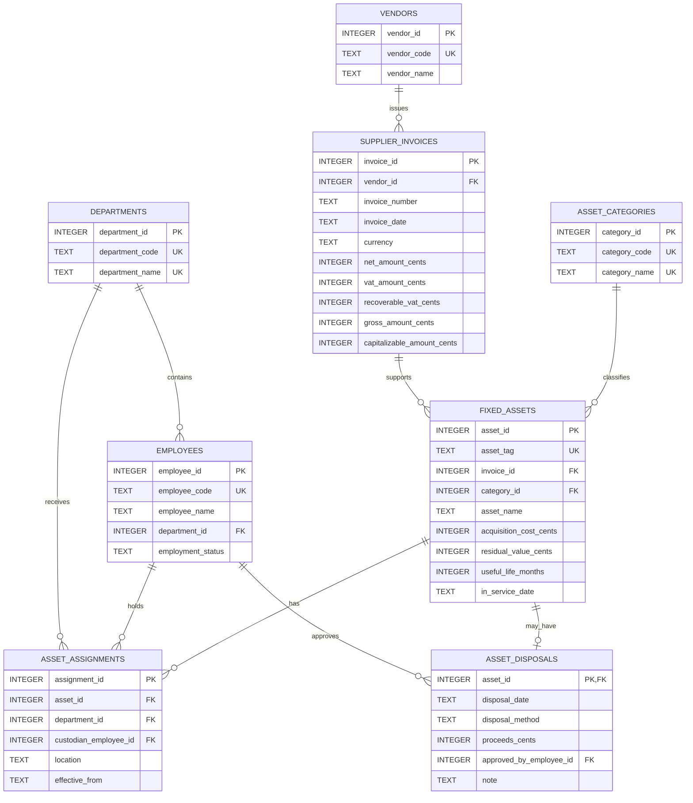

# Fixed Asset Subledger in SQLite

An educational SQLite fixed-asset subledger covering invoice provenance,
capitalization, assignment history, monthly straight-line depreciation, and
disposal.

This repository is a reconstruction of an early accounting information systems
course project. The original invoice-to-payment exercise has been narrowed and
redesigned around fixed-asset accounting so that its schema, constraints, and
reports can be checked directly. It is a portfolio demonstration, not an ERP or
a deployment reference.

Every person, organization, identifier, location, amount, and date in the seed
data is synthetic and exists only to make the example deterministic.

## What the project demonstrates

- Eight `STRICT` tables for departments, employees, vendors, supplier invoices,
  asset categories, fixed assets, assignment history, and disposals.
- Integer-cent CNY amounts, generated invoice totals, business-key uniqueness,
  required foreign keys, and `ON DELETE RESTRICT` relationships.
- Lifecycle triggers that reject assets dated before their invoice, assignments
  outside the asset's service period, and disposals before service or a recorded
  assignment.
- Invoice-to-asset capitalization reconciliation, including one invoice split
  across multiple asset cards.
- Assignment intervals calculated with `LEAD`, rather than storing a second date
  that can drift out of sync.
- A monthly depreciation schedule generated by a recursive CTE, with cumulative
  depreciation calculated by `SUM(...) OVER (...)`.
- A fixed-date asset register and a disposal gain-or-loss report whose expected
  values are covered by hand-calculated test oracles.
- A fresh in-memory demo with no third-party Python packages or persistent local
  database required.

## Quick start

Requirements: Python with SQLite 3.37 or newer. The automated test matrix targets
Python 3.11 and 3.13.

```bash
python3 -B demo.py
```

Run the test suite:

```bash
python3 -B -m unittest discover -s tests -v
```

The runner creates a new in-memory database, enables foreign-key enforcement for
that connection, and installs the schema, views, and synthetic fixtures in one
transaction. Re-running the demo starts from another empty database, so its
output is repeatable.

## Data model



One supplier invoice may support several asset cards. An asset may have many
assignments but at most one disposal. Asset status is derived from the disposal
record at the report date; it is not stored as a second, potentially conflicting
field.

## Accounting conventions

All stored money amounts are integer CNY cents. For each supplier invoice:

```text
gross amount         = net amount + VAT
capitalizable amount = net amount + VAT - recoverable VAT
```

Recoverable VAT must be between zero and total VAT. The reconciliation view
compares each invoice's capitalizable amount with the sum of its linked asset
costs and reports `MATCH` or `MISMATCH`. It is deliberately diagnostic rather
than a cross-row trigger, because an invoice can be entered before all of its
asset cards are recorded.

Depreciation follows these fixed rules:

1. Straight-line depreciation is calculated monthly in a reporting view.
2. The first charge is in the month after the in-service date.
3. The disposal month still receives a charge; the following month does not.
4. Integer division establishes the base charge. Any remainder cents are added,
   one cent per month, to the earliest periods.
5. A complete useful-life schedule therefore depreciates exactly to residual
   value, and reported net book value never falls below residual value.

The as-of report uses the fixed date `2026-12-31`, keeping the demo independent
of the computer's current date.

## Reports and SQL features

| Report | Question answered | Main SQL technique |
|---|---|---|
| Invoice reconciliation | Do linked asset costs equal capitalizable invoice value? | Generated columns, aggregate, `LEFT JOIN` |
| Assignment history | Who held an asset, where, and for which interval? | `LEAD(...) OVER (...)` |
| Monthly depreciation schedule | What is each monthly charge, accumulated depreciation, and net book value? | Recursive CTE, integer arithmetic, running `SUM` window |
| As-of asset register | What did the subledger show on 2026-12-31? | Parameter CTE, as-of joins, derived status |
| Disposal gain or loss | What were book value and proceeds at disposal? | CTEs and depreciation-to-disposal aggregation |

The seed includes two workstation cards tied to one invoice, an assignment
transfer, three active assets, and one disposed asset. Selected columns from
the deterministic `python3 -B demo.py` results are:

```text
INVOICE RECONCILIATION
invoice_number    | capitalizable_amount_cents | asset_count | difference_cents | reconciliation_status
SYN-IT-2024-001   | CNY 24,000.00              | 2           | CNY 0.00         | MATCH
SYN-HVAC-2024-001 | CNY 150,000.00             | 1           | CNY 0.00         | MATCH
SYN-VEH-2024-001  | CNY 220,000.00             | 1           | CNY 0.00         | MATCH

DISPOSAL GAIN OR LOSS
asset_tag    | disposal_date | net_book_value_at_disposal_cents | proceeds_cents | gain_loss_cents
SYN-VEH-0001 | 2026-09-15    | CNY 132,916.55                   | CNY 150,000.00 | CNY 17,083.45

DEMO OK
```

## Repository guide

| Path | Purpose |
|---|---|
| `sql/schema.sql` | Eight tables, indexes, checks, foreign keys, and lifecycle triggers |
| `sql/seed.sql` | Deterministic synthetic fixture data |
| `sql/views.sql` | Reconciliation, assignment-interval, and depreciation views |
| `sql/queries/` | Four read-only presentation queries |
| `ledger.py` | Connection setup, bounded SQL loading, atomic bootstrap, and query dispatch |
| `demo.py` | Deterministic command-line presentation |
| `tests/test_database.py` | Standard-library integration, constraint, and report tests |
| `.github/workflows/ci.yml` | Python 3.11/3.13 test and reproducibility checks |

The tests cover fresh bootstrap, rollback after a mid-script constraint failure,
foreign-key enforcement on every connection, invalid values and lifecycle dates,
reconciliation mismatches, depreciation boundaries and remainder cents,
assignment intervals, as-of balances, disposal gain or loss, and byte-for-byte
demo repeatability.

## Limitations

- SQLite 3.37 or newer is required for `STRICT` tables.
- The model supports one ledger, CNY only, monthly straight-line depreciation,
  and disposal of an entire asset only.
- Date checks validate the `YYYY-MM-DD` shape plus month `01`-`12` and day
  `01`-`31`; they do not implement complete calendar validation.
- There is no migration path from the earlier course schema.
- Accounts payable, payment processing, a broader ERP workflow, construction in
  progress, impairment, revaluation, component accounting, and partial disposal
  are outside the model.
- The depreciation schedule is derived for reporting; the project does not post
  depreciation journals or maintain an immutable accounting audit log.
- Spark, Hive, distributed storage, and other big-data infrastructure are not
  needed for this small relational demonstration and are not included.
- Concurrent multi-user operation, authentication, authorization, encryption,
  operational monitoring, and security hardening are outside scope.
